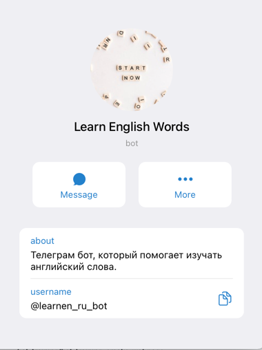
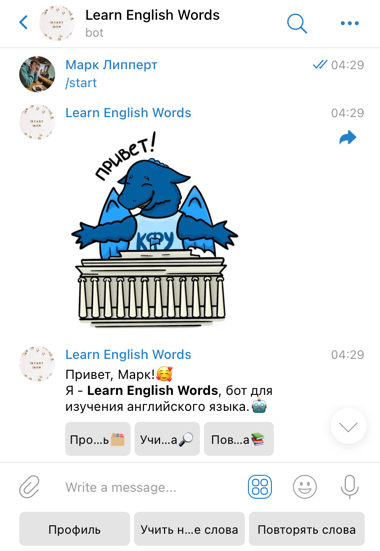

# Learn English words
Telegram bot for learning english word.

## Run
To launch the project 
  ```python
    python main.py
 ```

## Examples



## Contributors
| Person      | GitHub | Role |
| ----------- | ----------- |---|
| Lippert Mark | [lippertmark](https://github.com/lippertmark) | Team leader |
| Talova Olesya | [ttalova](https://github.com/ttalova) | Developer |
| Shakurov Amir | [ShakurSA](https://github.com/ShakurSA) | Developer |
| Novak Sergey | [sergeynovak1](https://github.com/sergeynovak1) | Database developer |
